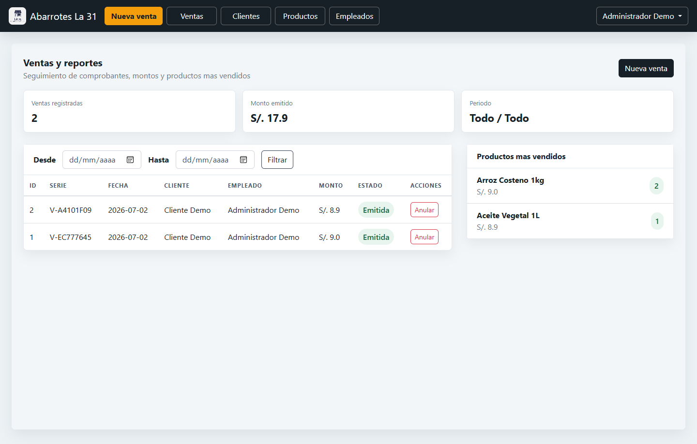
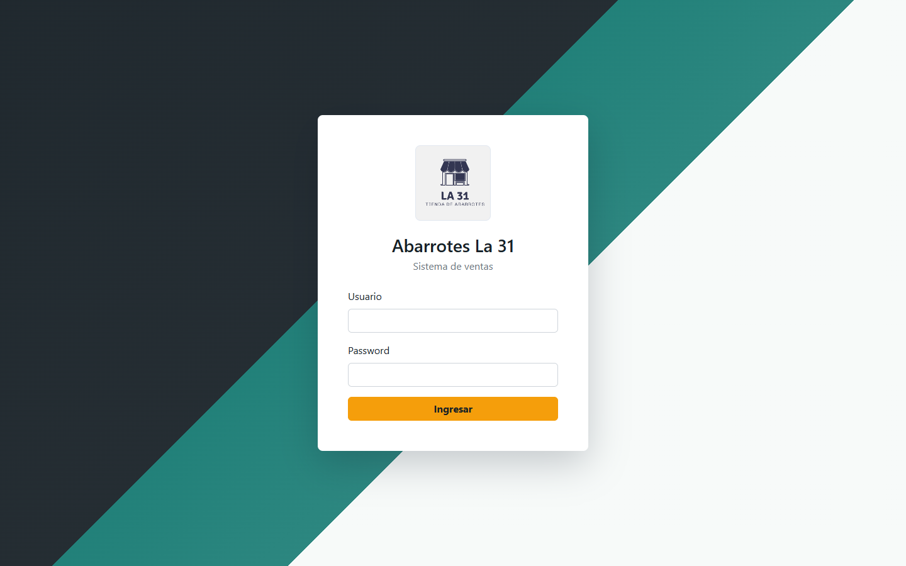
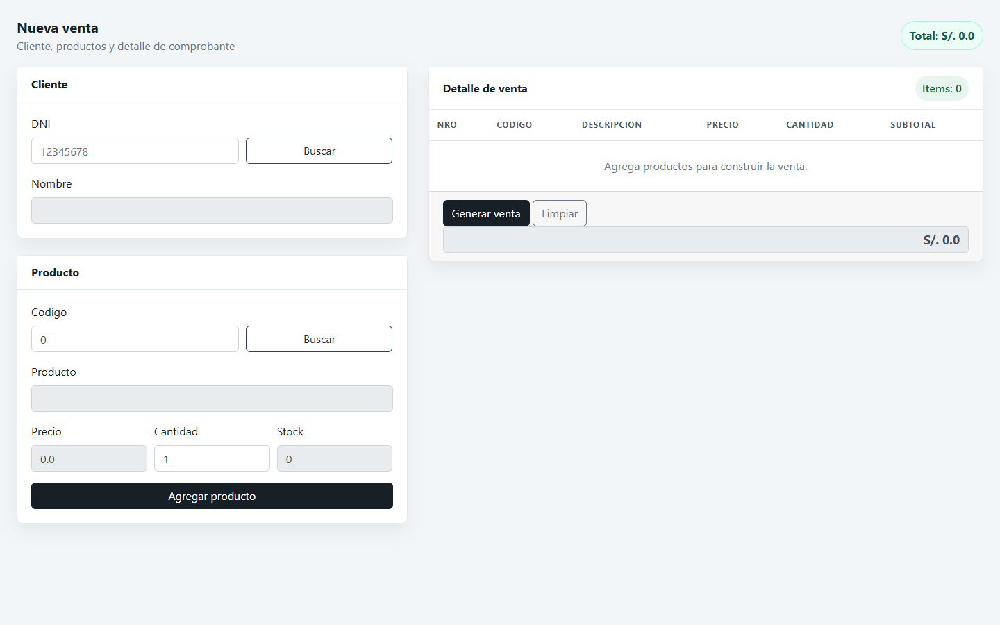
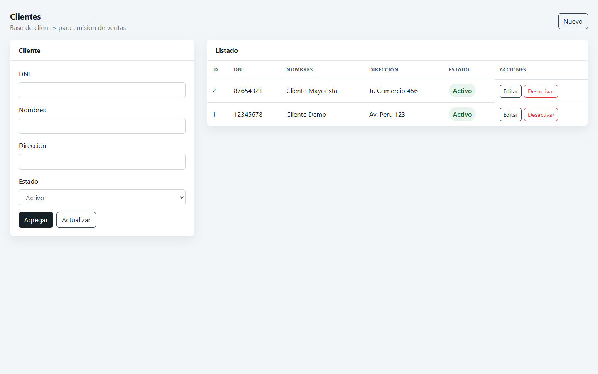
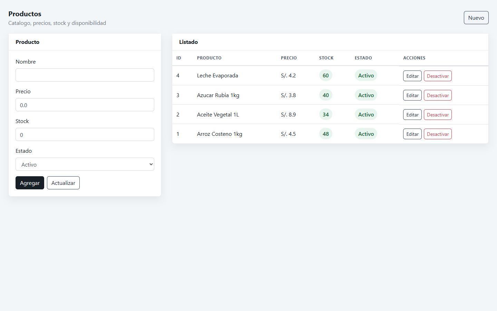

# SistemasVentasWeb


Sistema web universitario para gestionar ventas de una tienda de abarrotes. El
proyecto fue desarrollado como practica academica con Java Web clasico y
modernizado gradualmente para quedar ejecutable, documentado y presentable como
repositorio de portafolio.

**Autor:** Jheisson Loor

## Vista General

La aplicacion modela un punto de venta para **Abarrotes La 31**. Permite iniciar
sesion con empleados, administrar catalogos, registrar ventas, descontar stock,
consultar comprobantes y revisar reportes basicos.



## Modulos

- Autenticacion con roles `Administrador` y `Vendedor`.
- Gestion de empleados.
- Gestion de clientes.
- Gestion de productos, precios, stock y estado.
- Registro de ventas con cliente, producto, carrito por sesion y total.
- Listado de ventas con filtros por fecha.
- Anulacion de ventas con restauracion de stock.
- Reporte de productos mas vendidos.
- Base de datos reproducible con datos demo.

## Capturas

| Login | Nueva venta |
| --- | --- |
|  |  |

| Clientes | Productos |
| --- | --- |
|  |  |

## Stack

- Java 17
- Servlets + JSP
- JDBC
- MySQL/MariaDB
- JSTL
- Bootstrap 4
- Apache Tomcat 9
- NetBeans / Ant
- Maven
- GitHub Actions

## Ejecucion Local

1. Levantar MySQL/MariaDB.
2. Importar la base de datos:

```bash
mysql -h 127.0.0.1 -P 3307 -u root < database/schema.sql
```

3. Abrir el proyecto en NetBeans o compilar con Maven:

```bash
mvn package
```

4. Desplegar en Tomcat 9 y abrir:

```text
http://127.0.0.1:8081/SistemasVentasWeb/
```

## Configuracion De Base De Datos

Configuracion por defecto:

```text
Host: 127.0.0.1
Puerto: 3307
Base: bd_ventas
Usuario: root
Password: vacio
```

La conexion tambien puede configurarse con variables de entorno o propiedades
Java:

- `DB_URL`
- `DB_HOST`
- `DB_PORT`
- `DB_NAME`
- `DB_USER`
- `DB_PASSWORD`

Documentacion ampliada:

- [Base de datos](docs/database.md)
- [Arquitectura](docs/architecture.md)
- [Roadmap](docs/roadmap.md)

## Credenciales Demo

Administrador:

```text
usuario: admin
password: admin123
```

Vendedor:

```text
usuario: empleado
password: empleado123
```

Datos demo:

- Cliente: `12345678`
- Productos: `1`, `2`, `3`, `4`

## Mejoras Aplicadas

- Passwords con hash PBKDF2.
- Control de roles en servidor.
- Consultas SQL preparadas en DAOs principales.
- Manejo de errores con mensajes claros.
- Carrito de venta aislado por sesion.
- Transaccion para cabecera, detalle y descuento de stock.
- CRUD de empleados, clientes y productos.
- Baja logica para registros relacionados con ventas.
- Anulacion de ventas con restauracion de stock.
- Filtros y reporte de productos mas vendidos.
- Proteccion basica de formularios con token de sesion.
- Acciones destructivas por POST.
- Interfaz renovada con paneles, metricas y tablas responsivas.
- Soporte Maven y CI con GitHub Actions.
- Documentacion con capturas reales.

## Estado Del Proyecto

Este repositorio conserva su valor como proyecto universitario, pero ahora tiene
una base mas ordenada para seguir evolucionando. La siguiente mejora grande
recomendada es una version 2.0 con Spring Boot, Spring Security, JPA y pruebas
automatizadas mas completas.
