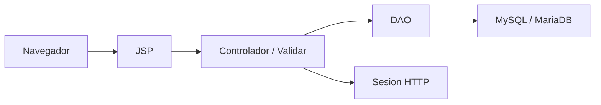

# Arquitectura

Proyecto Java Web clasico con Servlets, JSP y JDBC.



## Capas

- `web/`: vistas JSP, CSS, imagenes y `WEB-INF`.
- `src/java/Controlador`: servlets de autenticacion y flujo principal.
- `src/java/Modelo`: entidades y DAOs.
- `src/java/config`: conexion, excepciones y utilidades de password.
- `database/`: esquema SQL y migraciones.
- `docs/`: capturas y documentacion tecnica.

## Seguridad Basica

- Login contra usuarios activos.
- Passwords con PBKDF2.
- Validacion de rol en servidor.
- Formularios con token de sesion.
- Acciones destructivas por POST.
- Consultas preparadas para evitar SQL concatenado.

## Build

El proyecto conserva compatibilidad con NetBeans/Ant y tambien puede compilarse
con Maven:

```bash
mvn package
```

El resultado Maven se genera en:

```text
target/SistemasVentasWeb.war
```
