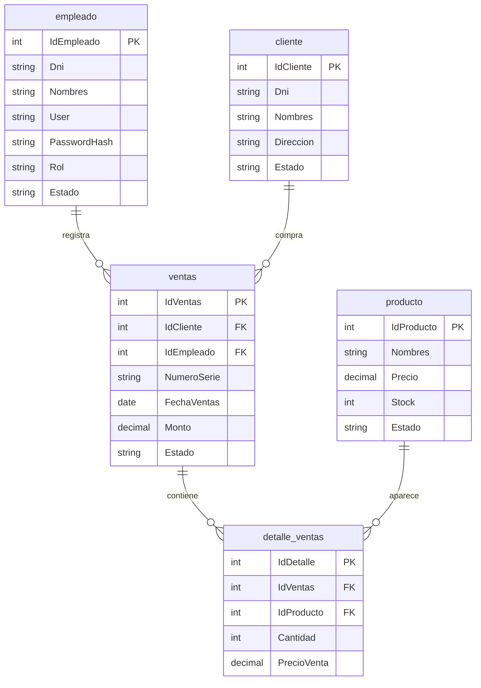

# Base De Datos

La base principal es `bd_ventas`. El script completo para crear tablas y datos
demo esta en `database/schema.sql`.

## Migraciones

Los scripts separados estan en `database/migrations/`:

- `001_create_schema.sql`: crea la base y tablas.
- `002_seed_demo_data.sql`: inserta usuarios, clientes y productos demo.
- `003_add_reporting_indexes.sql`: agrega indices para consultas y reportes.

## Entidades

## Indices

- `empleado(Estado, Rol)` para login y permisos.
- `cliente(Estado)` para ventas con clientes activos.
- `producto(Estado, Stock)` para busqueda y control de stock.
- `ventas(FechaVentas)` para filtros por fecha.
- `ventas(Estado)` para excluir ventas anuladas en reportes.
- `detalle_ventas(IdProducto)` para productos mas vendidos.

## Notas

- Las eliminaciones de empleados, clientes y productos se manejan como baja
  logica (`Estado='Inactivo'`) para no romper ventas historicas.
- La anulacion de ventas restaura stock en una transaccion.
- Los passwords demo estan hasheados con PBKDF2.
